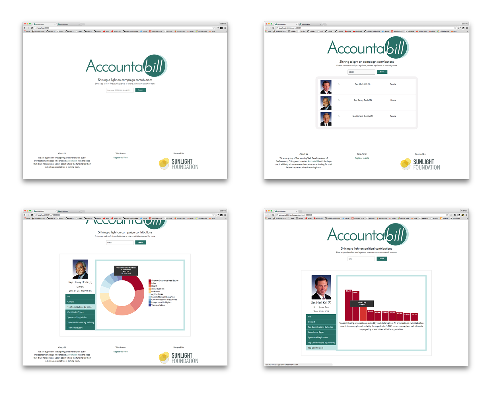

# Accountabill

[Live on Heroku](https://accountabill.herokuapp.com/)

Accountabill is an Open Source web application that provides a list of State Representatives and Senators based on a user's zipcode. A user can look at campaign contribution data for their Congress person for the latest election cycle. Information about contributing sectors, industries, individual vs. PAC and top contributors is available.

Built in 8 days, this web app is the final project of five newbie software developers graduating [Dev Bootcamp](http://devbootcamp.com/).

Accountabill uses the Congress v3 and Influence Explorer APIs from the [Sunlight Foundation](https://sunlightfoundation.com/api/).

### Screenshots

### Technologies
- Ruby on Rails
- Postgres with HStore
- Backbone JS
- Foundation
- SASS
- D3 JS Library
- OmniAuth

### Testing
- Travis
- SimpleCov
- RSpec
- Capybara
- VCR

### Team

Accountabill is the brainchild of [Gabriela Voicu](https://github.com/gabivoicu), [Ian Agne](https://github.com/ianagne), [Rachel Kolcheck](https://github.com/rkolcheck), [Shiraz Sherwani](https://github.com/PacoGuy) and [Elliott Young](https://github.com/ElliottAYoung). 
